# Sistema de Mantenimiento Predictivo con Inteligencia Artificial

**Universidad Nacional de Trujillo**  
**Facultad de Ciencias Físicas y Matemáticas**  
**Escuela Profesional de Ingeniería de Sistemas**  
**Curso:** Ingeniería de Software II (IS-402) | **Semestre:** 2026-II  
**Docente Titular:** Ing. Miguel Aguilar Reyes  

---

## 1. Contexto General y Metodología CRISP-DM

El presente sistema implementa una solución integral de **Mantenimiento Predictivo Industrial 4.0** orientado a operaciones de minería a cielo abierto en el Perú (carguío, acarreo y perforación en operaciones como Antamina, Cerro Verde y Yanacocha).

La arquitectura del motor de IA sigue estrictamente el estándar metodológico **CRISP-DM** (Cross-Industry Standard Process for Data Mining):
- **Fase 1: Comprensión del Negocio:** Reducir tiempos muertos no programados (MTTR >= 20%), incrementar la disponibilidad de flota (>= 5%) y optimizar costos de mantenimiento correctivo (>= 15%).
- **Fase 2: Comprensión de los Datos:** Ingesta de telemetría de más de 50 sensores en 12 equipos (temperatura de motor, presión de aceite, vibración triaxial en rodamientos, RPM y variables derivadas).
- **Fase 3: Preparación de los Datos:** Limpieza, imputación de anomalías, generación de variables de desgaste acumulado (*Feature Engineering*: rolling windows, razones y gradientes) y partición temporal cronológica 70/15/15.
- **Fase 4: Modelado:** Balanceo con **SMOTE** exclusivamente en el 70% de entrenamiento (semilla fija `random_state=42`) y entrenamiento de 5 algoritmos:
  1. *Random Forest*
  2. *XGBoost (Campeón)*
  3. *Support Vector Machines (SVM)*
  4. *Deep Learning Híbrido CNN-LSTM*
  5. *LSTM-Autoencoder + Random Forest*
- **Fase 5: Evaluación:** Evaluación en prueba ciega con métricas exigentes (Recall >= 90%, F1-Score >= 0.85, Accuracy >= 85%), validación cruzada con TimeSeriesSplit, pruebas de hipótesis (t-student pareada, McNemar) y análisis de sensibilidad.
- **Fase 6: Despliegue:** Inferencia interactiva en tiempo real (< 1 segundo), cálculo probabilístico de riesgo (Bajo, Medio, Alto, Crítico) y generación automática de alertas críticas.

---

## 2. Diagrama Entidad-Relación (30 Tablas en Mermaid)

```mermaid
erDiagram
    %% DOMINIO 1: EQUIPOS Y SENSORES
    TIPO_EQUIPO ||--o{ EQUIPO : categoriza
    EQUIPO ||--o{ SENSOR : monitoreado_por
    EQUIPO ||--o{ DEPENDENCIA_EQUIPO : "es padre o hijo"
    SENSOR ||--o{ PARAMETRO_REFERENCIA_SENSOR : calibra
    SENSOR ||--o{ LECTURA_SENSOR : registra
    TIPO_EQUIPO ||--o{ PIEZA_REPOSICION : usa

    %% DOMINIO 2: MANTENIMIENTO Y FALLAS
    EQUIPO ||--o{ EVENTO_MANTENIMIENTO : recibe
    EQUIPO ||--o{ FALLA : experimenta
    EVENTO_MANTENIMIENTO ||--o{ FALLA : atiende
    EVENTO_MANTENIMIENTO ||--o{ USO_PIEZA_MANTENIMIENTO : consume
    PIEZA_REPOSICION ||--o{ USO_PIEZA_MANTENIMIENTO : provee
    EQUIPO ||--o{ MANTENIMIENTO_PROGRAMADO : calendariza
    EQUIPO ||--o{ KPI_EQUIPO : consolida
    EQUIPO ||--o{ ALERTA : notifica

    %% DOMINIO 3: IA Y PREDICCIONES
    MODELO_IA ||--o{ EVALUACION_MODELO : evaluado_en
    MODELO_IA ||--o{ PREDICCION_FALLA : genera
    EQUIPO ||--o{ PREDICCION_FALLA : predicho_para
    DATOS_ENTRENAMIENTO ||--o{ MODELO_IA : entrena

    %% DOMINIO 4: USUARIOS Y SEGURIDAD RBAC
    USUARIO ||--o{ USUARIO_ROL : asignado
    ROL ||--o{ USUARIO_ROL : tiene
    ROL ||--o{ ROL_PERMISO : posee
    PERMISO ||--o{ ROL_PERMISO : concede
    USUARIO ||--o{ SESSION_USUARIO : abre
    USUARIO ||--o{ BITACORA_ACTIVIDAD : audita

    %% DOMINIO 5: REPORTES Y CONFIGURACIÓN
    USUARIO ||--o{ REPORTE_GENERADO : emite
    CONFIGURACION_SISTEMA {
        string clave_configuracion PK
        string valor_configuracion
        string tipo_dato
        string categoria_configuracion
    }
    VERSION_SISTEMA {
        int id_version PK
        string version_actual
        date fecha_version
        string descripcion_cambios
    }

    EQUIPO {
        int id_equipo PK
        int id_tipo_equipo FK
        string codigo_equipo
        string nombre_equipo
        string marca
        string modelo
        string estado_operativo
        int horas_operacion
    }
    SENSOR {
        int id_sensor PK
        int id_equipo FK
        string codigo_sensor
        string tipo_sensor
        float rango_minimo
        float rango_maximo
    }
    LECTURA_SENSOR {
        int id_lectura PK
        int id_sensor FK
        float valor_medido
        datetime timestamp_lectura
        string calidad_dato
    }
    PREDICCION_FALLA {
        int id_prediccion PK
        int id_equipo FK
        int id_modelo FK
        float probabilidad_falla
        string nivel_riesgo
        string tipo_falla_predicha
    }
    ALERTA {
        int id_alerta PK
        int id_equipo FK
        string tipo_alerta
        string nivel_gravedad
        string estado_alerta
    }
```



---

## 3. Estrategia de Ramas Git (Gitflow) & Convenciones

### Flujo de Trabajo Gitflow
1. **`main`**: Rama de producción protegida. Contiene únicamente código estable, probado y listo para release.
2. **`develop`**: Rama de integración continua. Todos los desarrollos terminados se fusionan aquí mediante Pull Requests con aprobación de al menos un revisor.
3. **`feature/*`**: Ramas para desarrollo de historias de usuario (ej. `feature/modulo-ia`, `feature/soft-delete-equipos`, `feature/jwt-auth`). Se originan de `develop` y se reintegran a `develop`.
4. **`release/*`**: Ramas de preparación para entrega y congelamiento de versión (ej. `release/v1.0.0`).
5. **`hotfix/*`**: Correcciones urgentes aplicadas directamente sobre `main` y propagadas a `develop`.

### Convención de Commits Semánticos (Conventional Commits)
- `feat: <descripción>`: Nuevas funcionalidades (ej: `feat: implementar balanceo SMOTE en conjunto de entrenamiento`).
- `fix: <descripción>`: Corrección de errores (ej: `fix: corregir cálculo de MTTR ante eventos con horas nulas`).
- `docs: <descripción>`: Cambios en documentación o README (ej: `docs: agregar diagrama de entidad-relación en mermaid`).
- `test: <descripción>`: Inclusión o mejora de pruebas unitarias (ej: `test: añadir pruebas de bloqueo tras 5 intentos fallidos`).
- `refactor: <descripción>`: Reestructuración de código sin alterar comportamiento.

---

## 4. Instalación y Ejecución Local

### Prerrequisitos
- Python 3.10 o superior
- PostgreSQL 14+ (con la base de datos `bd_mantenimiento_predictivo` creada)

### Pasos de Instalación
```bash
# 1. Clonar el repositorio
git clone https://github.com/unt-sistemas/mantenimiento-predictivo-is402.git
cd mantenimiento-predictivo-is402

# 2. Crear y activar entorno virtual
python3 -m venv venv
source venv/bin/activate  # En Windows: venv\Scripts\activate

# 3. Instalar dependencias
pip install -r requirements.txt

# 4. Configurar variables de entorno
cp .env.example .env
# Modificar los valores de conexión en .env si es necesario

# 5. Ejecutar la aplicación web Streamlit
streamlit run app.py
# O en Windows hacer doble clic en: run_app.bat
# O mediante npm: npm run dev
```
La aplicación iniciará automáticamente en `http://localhost:3000` (o el puerto configurado en `.streamlit/config.toml`).

---

## 5. Ejecución de la Suite de Pruebas

Para ejecutar las pruebas unitarias automatizadas con `pytest`:
```bash
pytest tests/ -v
```

Las pruebas cubren:
- **Autenticación:** Login exitoso, contraseñas erróneas, bloqueo de cuenta tras 5 fallos, caducidad de JWT.
- **Preprocesamiento:** Rangos físicos de sensores, consistencia de variables derivadas.
- **Inferencia:** Verificación de tiempo de respuesta estricto (< 1000 ms) y registro en `prediccion_falla`.

---

## 6. Credenciales de Prueba por Rol

| Rol | Usuario | Contraseña | Privilegios Principales |
| :--- | :--- | :--- | :--- |
| **Administrador** | `admin` | `Admin123*` | Acceso irrestricto, configuración, gestión de usuarios, entrenamiento IA |
| **Supervisor** | `supervisor` | `Super123*` | Monitoreo, lectura de flota, gestión y cierre de alertas, reportes |
| **Técnico** | `tecnico` | `Tecnico123*` | Telemetría, atención de alertas, inferencia de predicciones en campo |
| **Consultor** | `consultor` | `Consultor123*` | Acceso de solo lectura para auditoría y visualización de dashboards |
